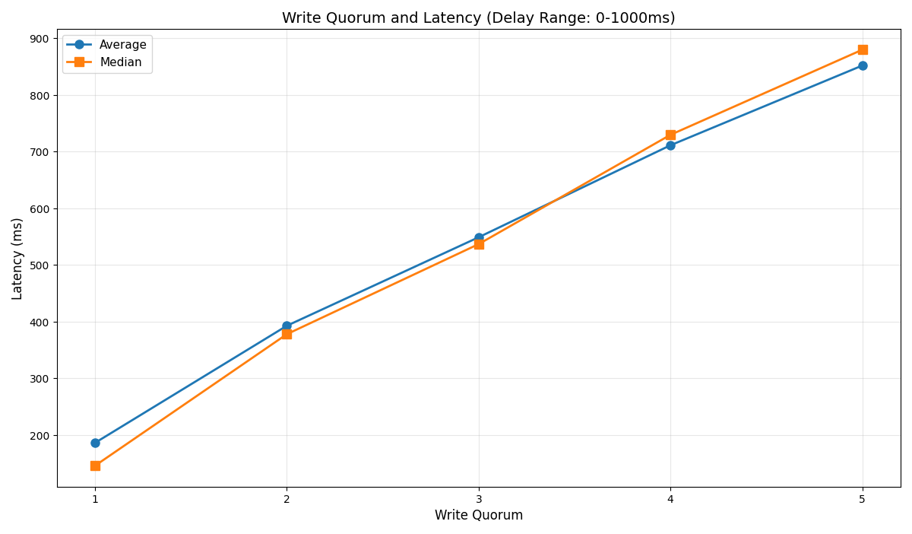
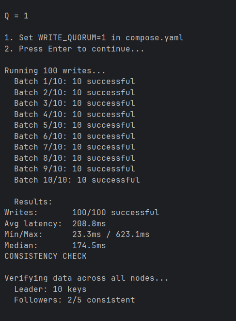
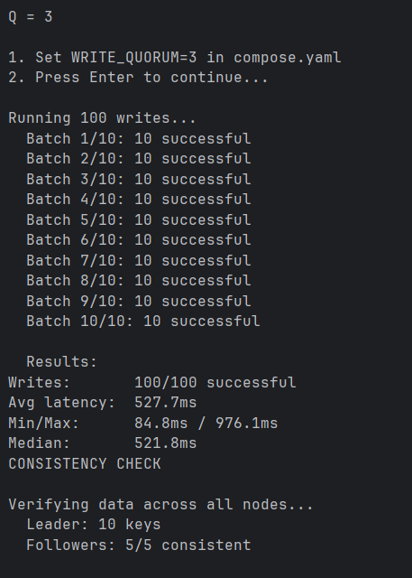
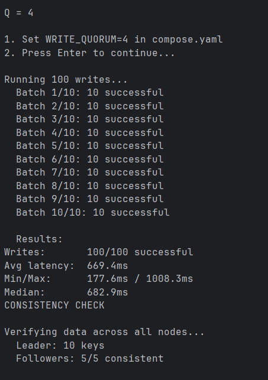
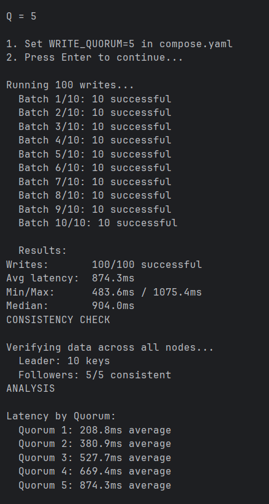
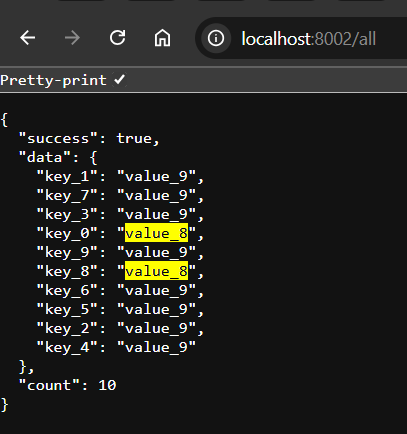
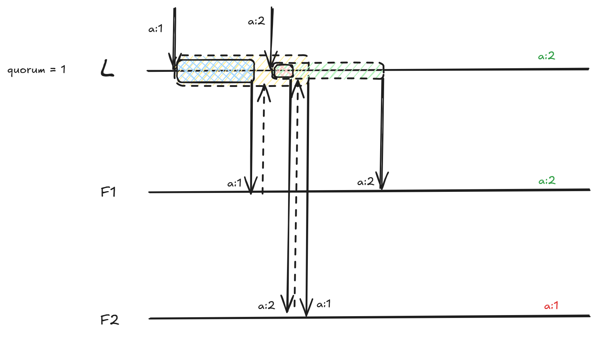
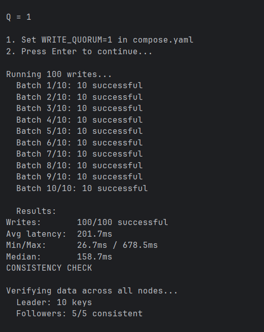

# leaders-followers

A distributed key-value store implementing single-leader replication with semi-synchronous replication and configurable write quorum.

### Semi-Synchronous Replication

The leader implements semi-synchronous replication where:

- Write is first committed to the leader's local store
- Replication requests are sent to all followers **concurrently**
- Each replication has a random delay between MIN_DELAY and MAX_DELAY
- The leader waits for `WRITE_QUORUM` followers to acknowledge
- Write is reported as successful once quorum is achieved

**Example**: With 5 followers and quorum=3, the write succeeds when any 3 of the 5 followers acknowledge, regardless of which 3 respond first.

### Write Quorum and Latency

Due to the uniform random delays, the relationship between write quorum and latency is linear and represented by the k-th order statistic: f(Q) = (MAX_DELAY - MIN_DELAY) * Q / (NUM_FOLLOWERS + 1) which is f(Q) = CONST * Q.
Therefore, no matter the number of followers, the graph would look the same.



### Replication

While performing replication, we can see some data inconsistencies, especially in the cases with a lower quorum (replication is considered successful faster and another one can begin, even though not all followers are guaranteed to have received the value).







This happens because a newer value can be overwritten by an older value due to the random delay when replicating from leader to followers.





### Timestamping values

In order to solve replication inconsistencies, each key value pair is timestamped with current time. 
When overwriting, new timestamp is checked to be greater than the current timestamp for this key.
```python
async def set(self, key: str, value: str, timestamp: float = None) -> bool:
    """Set key-value pair with timestamp. Returns True if updated, False if ignored."""
    current_ts = self._timestamps.get(key, 0)
    if timestamp is None or timestamp > current_ts:
        self._store[key] = value
        if timestamp is not None:
            self._timestamps[key] = timestamp
        return True
    return False
```

Even with quorum 1, all replicas have consistent data.



